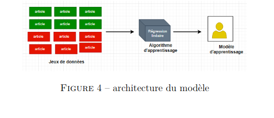

# SmartDetect
### This The project for Tunihack 6.0 hackathon

## The Problem:

Fake news destabilizes society and the security of citizens and creates an atmosphere of panic for no reason, 
and contributes to demolishing the bridge of trust between the citizens themselves, or between them and official and informal institutions.
Also since the emergence of the Coronavirus in our country, where we have witnessed a large number of publications containing fake news, including 
faking official and institutional communications to delude the recipient of these institutions issuing new decisions and developments.

## Our Solution:

So we propose an AI-powered solution that detects fake news in social media to help the government has better insights into the community and control the situation. 
To ensure better communication between them and the citizens in time of crises.

### -features developed:
	- Dashboard for displaying news from social media about Covid-19
	- Classify news into two categories: fake or real
	- Classification based on AI and machine learning
	
	

### -features to be developed:
	- Classify the propaganda technique of the news
	- Knowing the propaganda technique will the government in the decision making
	- Show the sources of each fake/real post
	- Working not only on Covid 19 news but all type of crises news
	- Make a web browser extension to analyze in real-time the browser content
	- Automatic scraping the most influenced posts on social media to classify them

### -Structure of the code:
	- The code is divided into 2 parts
	- Part for the web which was developed using Reactjs
	- The other part is For AI, in which you can find the models and the code required to train the AI models
